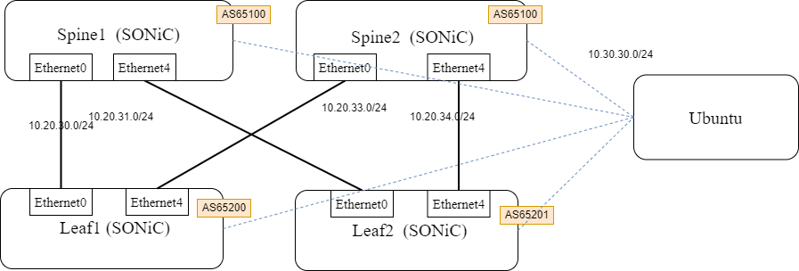

# SONiC Demo 1




## Management Node

download ubuntu img.
```bash
$ wget "https://cloud-images.ubuntu.com/focal/current/focal-server-cloudimg-amd64.img"
```

## FRRouting Config

### spine1

```
conf t

interface lo
  ip address 10.10.10.1/32
router bgp 65100
 bgp router-id 10.10.10.1
 no bgp ebgp-requires-policy
 bgp bestpath as-path multipath-relax
 neighbor FABRIC peer-group
 neighbor FABRIC remote-as external
 neighbor FABRIC capability extended-nexthop
 neighbor Ethernet0 interface peer-group FABRIC
 neighbor Ethernet4 interface peer-group FABRIC
 address-family ipv4 unicast
  network 10.20.30.0/24
  network 10.20.31.0/24
  network 10.10.10.1/32
 exit-address-family
```

### spine2

```
conf t

interface lo
  ip address 10.10.10.2/32
router bgp 65100
 bgp router-id 10.10.10.2
 no bgp ebgp-requires-policy
 bgp bestpath as-path multipath-relax
 neighbor FABRIC peer-group
 neighbor FABRIC remote-as external
 neighbor FABRIC capability extended-nexthop
 neighbor Ethernet0 interface peer-group FABRIC
 neighbor Ethernet4 interface peer-group FABRIC
 address-family ipv4 unicast
  network 10.20.33.0/24
  network 10.20.34.0/24
  network 10.10.10.2/32
 exit-address-family
```

### leaf1

```
conf t

interface lo
  ip address 10.10.10.3/32
router bgp 65200
 bgp router-id 10.10.10.3
 no bgp ebgp-requires-policy
 bgp bestpath as-path multipath-relax
 neighbor FABRIC peer-group
 neighbor FABRIC remote-as external
 neighbor FABRIC capability extended-nexthop
 neighbor Ethernet0 interface peer-group FABRIC
 neighbor Ethernet4 interface peer-group FABRIC
 address-family ipv4 unicast
  network 10.20.30.0/24
  network 10.20.33.0/24
  network 10.10.10.3/32
 exit-address-family
```

### leaf2

```
conf t

interface lo
  ip address 10.10.10.4/32
router bgp 65201
 bgp router-id 10.10.10.4
 no bgp ebgp-requires-policy
 bgp bestpath as-path multipath-relax
 neighbor FABRIC peer-group
 neighbor FABRIC remote-as external
 neighbor FABRIC capability extended-nexthop
 neighbor Ethernet0 interface peer-group FABRIC
 neighbor Ethernet4 interface peer-group FABRIC
 address-family ipv4 unicast
  network 10.20.31.0/24
  network 10.20.34.0/24
  network 10.10.10.4/32
 exit-address-family
```


## Telemetry Examples

### COUNTERS_DB
```
cd /home/shu1r0/go/src/github.com/jipanyang/gnxi/gnmi_get
go run gnmi_get.go  -xpath_target COUNTERS_DB -xpath COUNTERS_PORT_NAME_MAP -target_addr 10.30.30.2:8080 -notls
```

```
go run gnmi_get.go  -xpath_target COUNTERS_DB -xpath COUNTERS -target_addr 10.30.30.2:8080 -notls
```

```
go run gnmi_get.go  -xpath_target COUNTERS_DB -xpath RATES -target_addr 10.30.30.2:8080 -notls
```


### APPL_DB
```
go run gnmi_get.go  -xpath_target APPL_DB -xpath INTF_TABLE -target_addr 10.30.30.2:8080 -notls
```

```
go run gnmi_get.go  -xpath_target APPL_DB -xpath SWITCH_TABLE -target_addr 10.30.30.2:8080 -notls
```

### CONFIG_DB

```
go run gnmi_get.go  -xpath_target CONFIG_DB -xpath PORT -target_addr 10.30.30.2:8080 -notls
```

```
go run gnmi_get.go  -xpath_target CONFIG_DB -xpath SYSTEM_INTERFACE -target_addr 10.30.30.2:8080 -notls
```


## OpenConfig

```
go run gnmi_capabilities.go -target_addr 10.30.30.2:8080 -target_name sonic -notls
```

```
go run gnmi_get.go  -xpath_target openconfig -xpath /openconfig-interfaces:interfaces/interface[name=Ethernet0] -target_addr 10.30.30.2:8080 -notls 
```

## OTHERS
```
go run gnmi_get.go -target_addr  10.30.30.2:8080 -xpath_target OTHERS -xpath platform/cpu -notls
```

## sflow

### SONiC
```
sudo config sflow collector add test 10.30.30.1
sudo config sflow polling-interval 30
sudo config sflow interface enable all
sudo systemctl unmask sflow
sudo config sflow enable
```


### Server
```
sudo docker run -p 6343:6343/udp sflow/sflowtool
```

## info STATS

```
$ show interfaces counters
    IFACE    STATE    RX_OK    RX_BPS    RX_UTIL    RX_ERR    RX_DRP    RX_OVR    TX_OK    TX_BPS    TX_UTIL    TX_ERR    TX_DRP    TX_OVR
---------  -------  -------  --------  ---------  --------  --------  --------  -------  --------  ---------  --------  --------  --------
Ethernet0        U        0  0.00 B/s      0.00%         0         0         0        0  0.00 B/s      0.00%         0         0         0
Ethernet4        U        0  0.00 B/s      0.00%         0         0         0        0  0.00 B/s      0.00%         0         0         0
```

```
$ show interface counters detailed Ethernet0
Packets Received 64 Octets..................... 0
Packets Received 65-127 Octets................. 0
Packets Received 128-255 Octets................ 0
Packets Received 256-511 Octets................ 0
Packets Received 512-1023 Octets............... 0
Packets Received 1024-1518 Octets.............. 0
Packets Received 1519-2047 Octets.............. 0
Packets Received 2048-4095 Octets.............. 0
Packets Received 4096-9216 Octets.............. 0
Packets Received 9217-16383 Octets............. 0

Total Packets Received Without Errors.......... 0
Unicast Packets Received....................... 0
Multicast Packets Received..................... 0
Broadcast Packets Received..................... 0

Jabbers Received............................... 0
Fragments Received............................. 0
Undersize Received............................. 0
Overruns Received.............................. 0

Packets Transmitted 64 Octets.................. 0
Packets Transmitted 65-127 Octets.............. 0
Packets Transmitted 128-255 Octets............. 0
Packets Transmitted 256-511 Octets............. 0
Packets Transmitted 512-1023 Octets............ 0
Packets Transmitted 1024-1518 Octets........... 0
Packets Transmitted 1519-2047 Octets........... 0
Packets Transmitted 2048-4095 Octets........... 0
Packets Transmitted 4096-9216 Octets........... 0
Packets Transmitted 9217-16383 Octets.......... 0

Total Packets Transmitted Successfully......... 0
Unicast Packets Transmitted.................... 0
Multicast Packets Transmitted.................. 0
Broadcast Packets Transmitted.................. 0
Time Since Counters Last Cleared............... 2022-06-27 02:14:47.515725
```